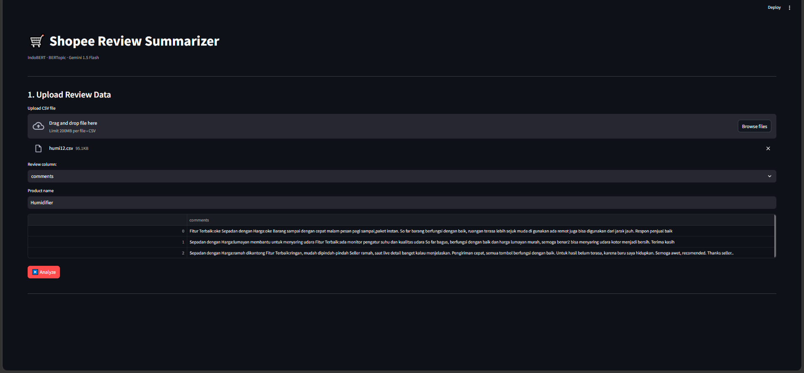
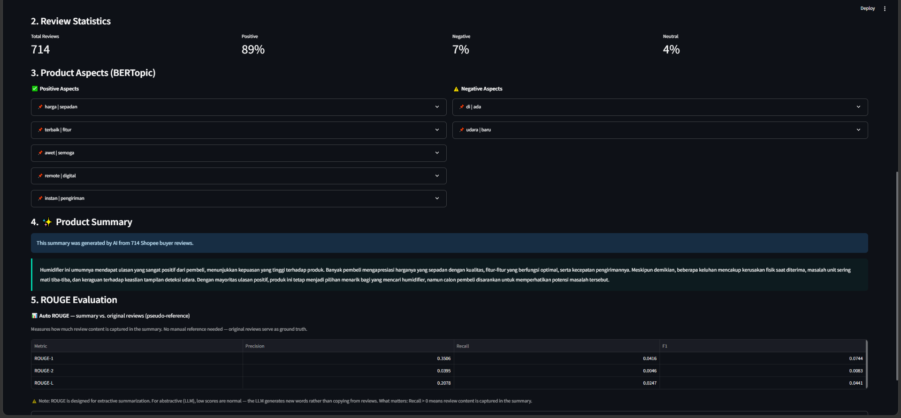
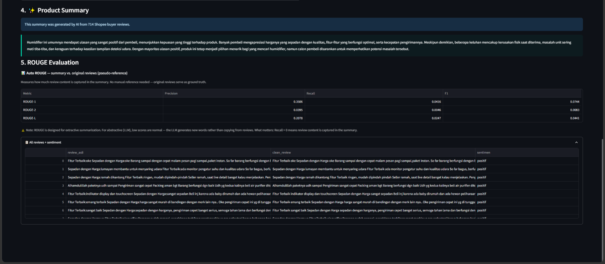

# 🛒 Product Review Summarizer

An AI-powered system that automatically summarizes Indonesian e-commerce product reviews into a single, coherent paragraph — helping sellers and product teams understand customer sentiment without reading hundreds of reviews manually.

> Built as an upgrade to my undergraduate thesis *(Peringkasan Ulasan Produk Rumah Tangga Menggunakan BERTopic dan Maximal Marginal Relevance, Universitas Sumatera Utara, 2024)*, replacing extractive MMR summarization with abstractive LLM generation.

---

## 📸 Demo

| Upload | Analyze | Results |
|---|---|---|
|  |  |  |

> Tested on 714 Indonesian humidifier reviews from Shopee — 89% positive, 7% negative, 4% neutral.

---

## 🧠 How It Works

```
CSV Upload (Indonesian reviews)
       ↓
Minimal Preprocessing
(noise removal only — no stemming/stopwords)
       ↓
IndoBERT Sentiment Classification
(positive / negative / neutral per sentence)
       ↓
BERTopic Topic Modeling (per sentiment)
(SBERT embeddings → UMAP → HDBSCAN → c-TF-IDF)
       ↓
Gemini LLM Summarization
(all aspects + sentiment distribution → 1 unified paragraph)
       ↓
Auto ROUGE Evaluation
(BERTopic representative sentences as pseudo-reference)
```

### Why no stemming or stopword removal?

IndoBERT and BERTopic both use transformer-based contextual embeddings trained on natural text. Removing stopwords before feeding them actually **hurts** performance — for example, `"tidak bagus"` (not good) becomes `"bagus"` (good) after stopword removal, causing IndoBERT to misclassify it as positive.

---

## 🏗️ Tech Stack

| Component | Model / Library | Purpose |
|---|---|---|
| Sentiment Analysis | [IndoBERT](https://huggingface.co/mdhugol/indonesia-bert-sentiment-classification) | Classify each review sentence as positive / negative / neutral |
| Topic Modeling | [BERTopic](https://maartengr.github.io/BERTopic/) | Discover key aspects from review clusters |
| Embeddings | `paraphrase-multilingual-MiniLM-L12-v2` | Multilingual sentence embeddings (supports Indonesian) |
| Summarization | Gemini 1.5 Flash (REST API) | Generate abstractive unified paragraph |
| Evaluation | ROUGE-1, ROUGE-2, ROUGE-L | Measure summary quality (auto, no manual reference) |
| UI | Streamlit | Interactive web interface |

---

## 🚀 Getting Started

### 1. Clone the repo

```bash
git clone https://github.com/rizkiamandaa/product-review-summarizer.git
cd product-review-summarizer
```

### 2. Install dependencies

```bash
pip install -r requirements.txt
```

### 3. Set up your API key

Create a `.env` file in the root directory:

```
GEMINI_API_KEY=your_api_key_here
```

Get a free Gemini API key at [aistudio.google.com](https://aistudio.google.com).

### 4. Run the app

```bash
streamlit run shopee_review_sum.py
```

---

## 📂 Input Format

Upload a `.csv` file with at least one column containing review text in Indonesian. Example:

| comments |
|---|
| Produk bagus banget, pengiriman cepat, seller ramah |
| Kualitas oke tapi agak bising kalau dipakai lama |
| Sudah pakai 2 minggu, berfungsi dengan baik semoga awet |

Any column name works — you select it in the UI after upload.

---

## 📊 Output

### Sentiment Distribution
```
Total Reviews: 714
Positive: 89% | Negative: 7% | Neutral: 4%
```

### Top 5 Positive Aspects (BERTopic)
- `harga | sepadan` — price is worth it
- `awet | semoga` — hoping it lasts long
- `ok | pengiriman` — good delivery
- ...

### Top 5 Negative Aspects (BERTopic)
- `udara | aja` — air quality concerns
- `hari | padahal` — delivery delay
- ...

### Final Summary (Gemini)
> *"Humidifier ini secara keseluruhan mendapat respons yang sangat positif dari para pembeli. Produk ini banyak dipuji karena harganya yang sepadan dengan harga dan fitur air purifier yang berfungsi optimal. Meskipun demikian, beberapa pembeli mengeluhkan akurasi sensor pendeteksi udara yang dirasa kurang akurat, serta adanya potensi kerusakan fisik kecil seperti penutup yang pecah saat produk diterima. Meskipun ada beberapa kekurangan, produk ini tetap direkomendasikan untuk calon pembeli yang mencari solusi pembersih udara dengan harga ekonomis."*

### ROUGE Score (Auto)
| Metric | Precision | Recall | F1 |
|---|---|---|---|
| ROUGE-1 | 0.4722 | 0.0435 | 0.0796 |
| ROUGE-2 | 0.0963 | 0.0051 | 0.0111 |
| ROUGE-L | 0.2639 | 0.0243 | 0.0445 |

> ROUGE scores are naturally low for abstractive summarization — the LLM generates new sentences rather than extracting from reviews. Recall > 0 confirms review content is represented in the summary.

---

## 🔄 Evolution from Thesis

| | Thesis (2024) | This Project |
|---|---|---|
| Summarization | Extractive (MMR) | Abstractive (LLM) |
| Output | Separate positive/negative | Single unified paragraph |
| Sentiment weighting | Not reflected in output | Proportional to distribution |
| Language quality | Stitched sentences | Natural prose |
| ROUGE F1 (positive) | 0.157 | 0.0796* |

*Lower F1 expected for abstractive — LLM generates new words, making n-gram overlap with reference lower. Semantic quality is significantly higher.

---

## 📁 Project Structure

```
product-review-summarizer/
├── shopee_review_sum.py   # Main application
├── requirements.txt       # Python dependencies
├── README.md
└── assets/
    ├── upload.png         # Screenshot: upload screen
    └── final_output.png         # Screenshot: result screen
```

---

## ⚠️ Notes

- This system is designed for **Indonesian-language reviews**. Performance on other languages may vary.
- Gemini API free tier has rate limits — if you hit a 429 error, wait 60 seconds and retry.
- BERTopic requires at least ~20 reviews per sentiment class to form meaningful clusters.

---

## 👩‍💻 Author

**Rizki Amanda Putri** — S1 Teknologi Informasi, Universitas Sumatera Utara

---
